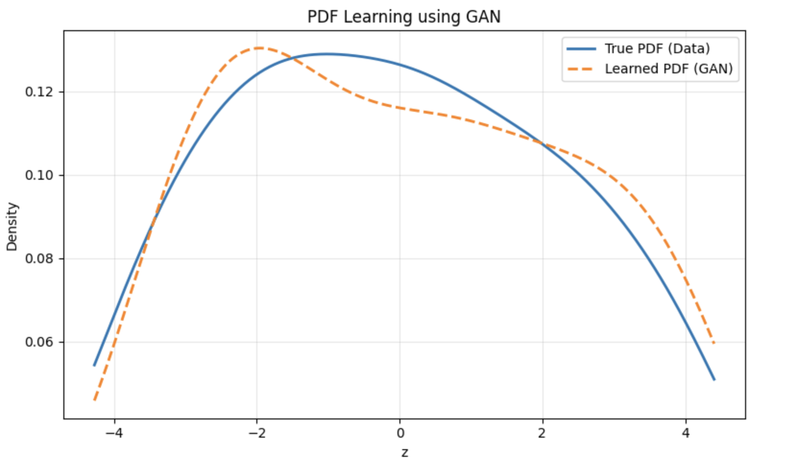

# 📊 Learning Probability Density Functions using GAN

## 🧾 Assignment Overview
This project focuses on learning an **unknown probability density function (PDF)** of a transformed random variable using a **Generative Adversarial Network (GAN)**.  
The distribution is learned **purely from data samples**, without assuming **any parametric form**.

---

## 🔢 Transformation Parameters ((a_r, b_r))

The transformation applied to the NO₂ concentration data (x) is:

**z = x + a_r sin(b_r x)**

The parameters are derived from the university roll number.

- 🎓 **Roll Number:** `102303773`

**a_r** = 0.5 × (r mod 7)  
**b_r** = 0.3 × ((r mod 5) + 1)

✅ The values of **(a_r)** and **(b_r)** are **computed programmatically** in the code, ensuring **reproducibility** and **strict adherence** to the assignment guidelines.

---

## 🧠 GAN Architecture Description

A **vanilla GAN** is used to implicitly model the PDF of the transformed variable \(z\).

### 🔹 Generator
- **Input:** Gaussian noise \(\epsilon \sim \mathcal{N}(0,1)\)
- **Architecture:**  
  `1 → 128 → 128 → 1`
- **Activations:** ReLU
- **Objective:** Generate samples that resemble the real transformed data

### 🔹 Discriminator
- **Input:** Real or generated samples of \(z\)
- **Architecture:**  
  `1 → 128 → 128 → 1`
- **Activations:** LeakyReLU
- **Output:** Sigmoid
- **Objective:** Distinguish real samples from generated ones

⚠️ **No analytical or parametric probability distribution is assumed at any stage.**

---

## 📈 Learned PDF using GAN

After training:
- A large number of samples are generated using the **generator**
- The **probability density function** is estimated using **Kernel Density Estimation (KDE)**

The final comparison includes:
- 📌 True PDF estimated from real transformed data  
- 📌 Learned PDF estimated from GAN-generated samples  

### 📊 Final PDF Comparison Plot
**PDF Learning using GAN**

---

## 🔍 Observations

### 🧩 Mode Coverage
The GAN successfully captures the **multi-modal structure** introduced by the sinusoidal transformation.  
All major modes present in the data distribution are represented, with **no evidence of mode collapse**.

### ⚖️ Training Stability
Training remains **stable** throughout the process.  
Generator and discriminator losses remain **bounded**, indicating a balanced adversarial learning process.

### 🎯 Quality of Generated Distribution
The learned distribution closely approximates the **empirical distribution** of the transformed data.  
Minor differences in peak amplitudes are observed, which are expected due to adversarial training dynamics and KDE smoothing.

---

✨ **This project demonstrates the effectiveness of GANs for implicit density learning when explicit probability models are unavailable.**
